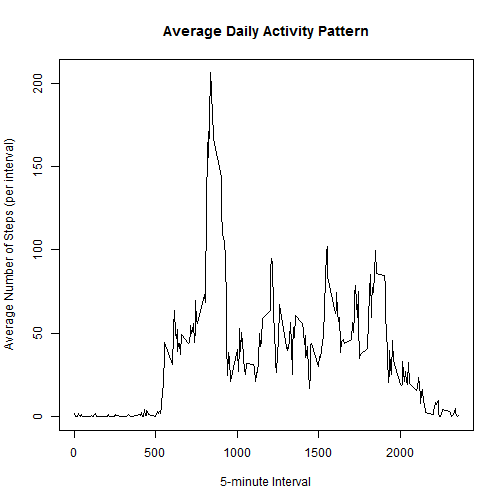
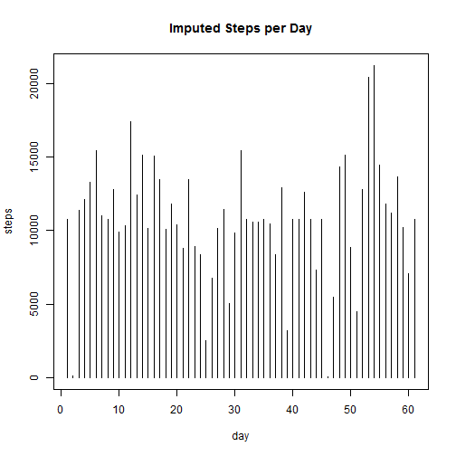
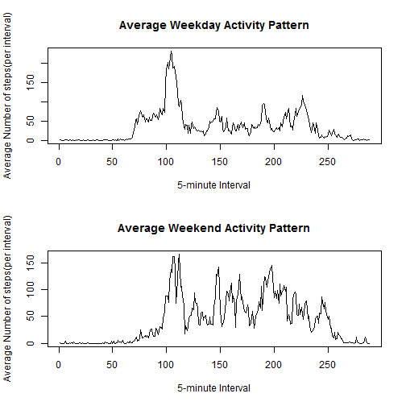

### Introduction
This report analyzes data about personal movement collected from activity monitoring devices such as a Fitbit, Nike Fuelband, or Jawbone Up. The device collects data at 5 minute intervals throughout the day. The data consists of two months of data from an anonymous individual collected during the months of October and November, 2012 and includes the number of steps taken in 5 minute intervals each day.

### Data
The data for this report can be downloaded from the Reproducible Research Course Web Site:

  - Dataset: https://d396qusza40orc.cloudfront.net/repdata%2Fdata%2Factivity.zip [52K]
The variables included in this dataset are:

  - steps: Number of steps taken in a 5-minute interval (missing values are coded as NA)
  
  - date: The date on which the measurement was taken in YYYY-MM-DD format
  
  - interval: Identifier for the 5-minute interval in which measurement was taken
The dataset is stored in a comma-separated-value (CSV) file and there are a total of 17,568 observations in this dataset.

### Loading and preprocessing the Data

```r
amd <- read.csv("activity.csv", colClasses = c("numeric", "character", "numeric"))
```

###What is the mean total number of steps taken per day?

```r
vector <- !is.na(amd[, "steps"])
  clean_amd <- amd[vector, ]
  unique_date_vector <- unique(clean_amd[,"date"])
  steps_vector <- NULL
  for(i in 1:length(unique_date_vector)) { 
    amd_date_obs <- clean_amd[clean_amd[,"date"] == unique_date_vector[i],]
    total_steps <- sum(amd_date_obs[,"steps"])
    steps_vector <- c(steps_vector, total_steps)
  }
  plot(steps_vector, type = "h", xlab = "day", ylab = "steps", main = "Steps per Day")
```

 

```r
  print(paste("mean =", mean(steps_vector)), sep = "")
```

```
## [1] "mean = 10766.1886792453"
```

```r
  print(paste("median =", median(steps_vector)), sep = "")
```

```
## [1] "median = 10765"
```
 The mean total number of steps taken per day is 10766.19
 The median total number of steps taken per day is 10765.
 
### What is the average daily activity pattern?

```r
aggregate_amd <- aggregate(steps ~ interval, data = amd, mean, na.rm = TRUE)
  plot(aggregate_amd$interval, aggregate_amd$steps, type = "l", xlab = "5-minute Interval", ylab = "Average Number of Steps (per interval)", main = "Average Daily Activity Pattern")
```

 

```r
  max_steps <- order(aggregate_amd$steps, decreasing = TRUE)
  print(aggregate_amd[max_steps[1], "interval"])
```

```
## [1] 835
```
The 5-minute interval on average across all days in the dataset containing the maximum number of steps is interval 8:35 to 8:40 am.

### Imputing Missing Values

```r
print(sum(is.na(amd)))
```

```
## [1] 2304
```

```r
new_steps <- rep(aggregate_amd$steps, length.out = length(amd$steps))
  logical_vector <- is.na(amd$steps)
  amd[logical_vector, "steps"] <- 0
  new_steps[!logical_vector] <- 0
  amd$steps <- amd$steps + new_steps
  aggregate_amd <- aggregate(steps ~ date, data = amd, sum)
  print(paste("mean with NAs filled =", mean(aggregate_amd$steps)), sep = "")
```

```
## [1] "mean with NAs filled = 10766.1886792453"
```

```r
  print(paste("median with NAs filled=", median(aggregate_amd$steps)), sep = "")  
```

```
## [1] "median with NAs filled= 10766.1886792453"
```

```r
  plot(aggregate_amd$steps, type = "h", xlab = "day", ylab = "steps", main = "Imputed Steps per Day")
```

 

There are 2304 missing values in the dataset.
These NAs were filled in with the mean for that 5-minute interval over all days.
Now the median and mean are equal to the mean calculated without NAs filled.

###Are there differences in activity patterns between weekdays and weekends?

```r
amd$date <- weekdays(as.Date(amd$date, "%Y-%m-%d")) 
  amd$daytype <- as.factor(ifelse(amd$date %in% c("Saturday", "Sunday"), "Weekend", "Weekday"))
  interval_steps <- aggregate(steps ~ interval + daytype, data = amd, mean)
  par(mfrow = c(2,1))
  plot(interval_steps[interval_steps$daytype == "Weekday", "steps"], type = "l", xlab = "5-minute Interval", ylab = "Average Number of steps(per interval)", main = "Average Weekday Activity Pattern")
  plot(interval_steps[interval_steps$daytype == "Weekend", "steps"], type = "l", xlab = "5-minute Interval", ylab = "Average Number of steps(per interval)", main = "Average Weekend Activity Pattern")
```

 

Here we can see that during Weekdays there is an isolated spike in activity between 8:30 and 9 in the morning, while during the weekends the activity is more evenly spread out throughout the day. 
  
